<!-- Badges das Tecnologias -->
[](https://www.python.org/)
[](https://flask.palletsprojects.com/)
[](https://socket.io/)
[](https://www.mysql.com/)
[](https://opencv.org/)
[](https://github.com/ageitgey/face_recognition)
[](https://getbootstrap.com/)

# 🎓 Sistema de Controle de Presença por Reconhecimento Facial

## ✨ Funcionalidades Principais

- **Monitoramento em Tempo Real**  
  Acompanhe o feed de vídeo da câmera e receba logs de presença e ausência a cada 30 segundos. Suporte para múltiplas câmeras simultâneas.  
- **Cadastro de Alunos**  
  - **Modo Normal**: Captura de foto diretamente no navegador via webcam para registrar novos perfis faciais.
  - **Modo Teste**: Upload de arquivo de imagem para cadastro sem necessidade de câmera física.
- **Seleção de Câmera**  
  Escolha qual dispositivo de vídeo usar tanto no monitoramento quanto no cadastro.  
- **Gerenciamento de Alunos**  
  Interface completa para listar, editar (nome/foto/responsável) e excluir alunos cadastrados. Atualização automática da lista ao abrir a aba.  
- **Modo Teste com Vídeos**  
  Teste o sistema usando arquivos de vídeo ao invés de câmeras reais. Suporte para múltiplos vídeos simultâneos.  
- **Interface Web Moderna**  
  Layout responsivo e interativo com atualizações em tempo real via Socket.IO. Tema escuro otimizado para melhor legibilidade.  
- **Persistência em MySQL**  
  Todas as informações e encodings faciais são armazenados em banco de dados relacional.  
- **Notificações por E-mail**  
  Sistema integrado de envio de e-mails para alertas e notificações aos responsáveis.
  
### 🛠️ Pilha Técnica
- **Backend**: Python (Flask + Flask-SocketIO)
- **Reconhecimento Facial**: `face-recognition` e `opencv-python`
- **Banco de Dados**: MySQL
- **Frontend**: HTML5, CSS3, JavaScript, Bootstrap 5, Socket.IO Client
- **Serviço de E-mail**: SMTP com TLS

### 📋 Requisitos
- Python 3.8+
- Servidor MySQL
- Webcam
- Conexão com a internet (para funcionalidade de e-mail)

---

## 📊 Diagramas UML

### 🔹 Diagramas Estruturais

#### 1. Diagrama de Classes
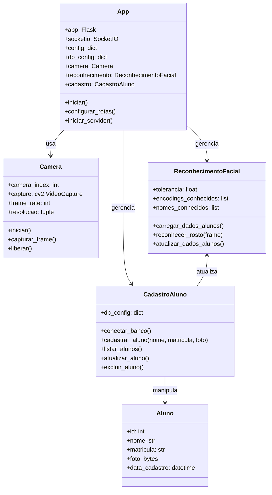
```mermaid
classDiagram
    %% Classe Principal da Aplicação
    class App {
        +app: Flask
        +socketio: SocketIO
        +config: dict
        +db_config: dict
        +camera: Camera
        +reconhecimento: ReconhecimentoFacial
        +cadastro: CadastroAluno
        +iniciar()
        +configurar_rotas()
        +iniciar_servidor()
    }
    
    %% Gerenciamento de Câmera
    class Camera {
        +camera_index: int
        +capture: cv2.VideoCapture
        +frame_rate: int
        +resolucao: tuple
        +iniciar()
        +capturar_frame()
        +liberar()
    }
    
    %% Reconhecimento Facial
    class ReconhecimentoFacial {
        +tolerancia: float
        +encodings_conhecidos: list
        +nomes_conhecidos: list
        +carregar_dados_alunos()
        +reconhecer_rosto(frame)
        +atualizar_dados_alunos()
    }
    
    %% Cadastro de Alunos
    class CadastroAluno {
        +db_config: dict
        +conectar_banco()
        +cadastrar_aluno(nome, matricula, foto)
        +listar_alunos()
        +atualizar_aluno()
        +excluir_aluno()
    }
    
    %% Classe Aluno
    class Aluno {
        +id: int
        +nome: str
        +matricula: str
        +foto: bytes
        +data_cadastro: datetime
    }
    
    %% Relacionamentos
    App --> Camera: usa
    App --> ReconhecimentoFacial: gerencia
    App --> CadastroAluno: gerencia
    CadastroAluno --> Aluno: manipula
    ReconhecimentoFacial <-- CadastroAluno: atualiza
```

#### 2. Diagrama de Objetos
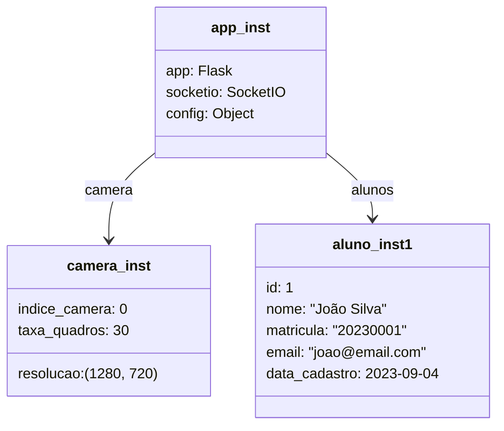
```mermaid
classDiagram
    class app_inst {
        app: Flask
        socketio: SocketIO
        config: Object
    }
    
    class camera_inst {
        indice_camera: 0
        taxa_quadros: 30
        resolucao: (1280, 720)
    }
    
    class aluno_inst1 {
        id: 1
        nome: "João Silva"
        matricula: "20230001"
        email: "joao@email.com"
        data_cadastro: 2023-09-04
    }
    
    app_inst --> camera_inst: camera
    app_inst --> aluno_inst1: alunos
```

#### 3. Diagrama de Componentes
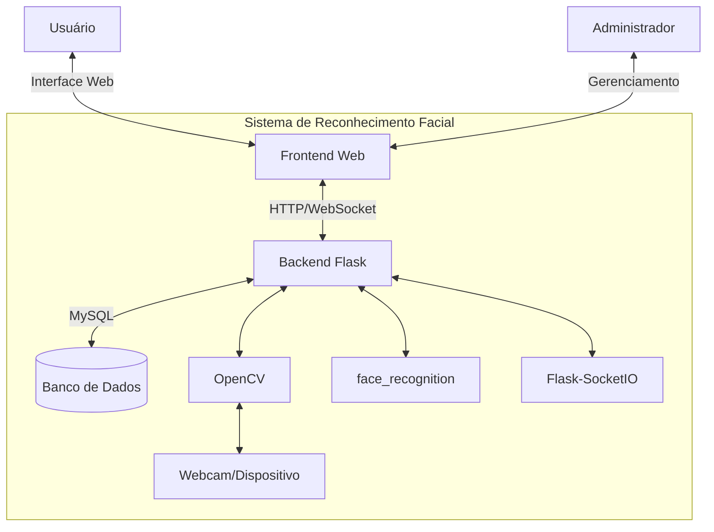
```mermaid
graph TD
    subgraph "Sistema de Reconhecimento Facial"
        A[Frontend Web] <-->|HTTP/WebSocket| B[Backend Flask]
        B <-->|MySQL| C[(Banco de Dados)]
        B <--> D[OpenCV]
        B <--> E[face_recognition]
        B <--> F[Flask-SocketIO]
        D <--> G[Webcam/Dispositivo]
    end
    
    H[Usuário] <-->|Interface Web| A
    I[Administrador] <-->|Gerenciamento| A
```

#### 4. Diagrama de Pacotes
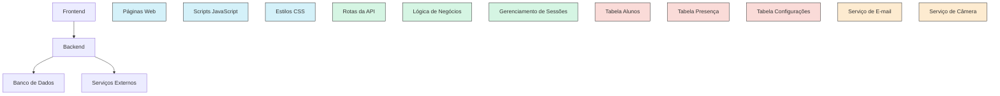
```mermaid
graph TD
    %% Sistema Principal
    A[Frontend] --> B[Backend]
    B --> C[Banco de Dados]
    B --> D[Serviços Externos]
    
    %% Frontend
    A1[Páginas Web]:::frontend
    A2[Scripts JavaScript]:::frontend
    A3[Estilos CSS]:::frontend
    
    %% Backend
    B1[Rotas da API]:::backend
    B2[Lógica de Negócios]:::backend
    B3[Gerenciamento de Sessões]:::backend
    
    %% Banco de Dados
    C1[Tabela Alunos]:::database
    C2[Tabela Presença]:::database
    C3[Tabela Configurações]:::database
    
    %% Serviços Externos
    D1[Serviço de E-mail]:::services
    D2[Serviço de Câmera]:::services
    
    %% Estilos
    classDef frontend fill:#d4f1f9,stroke:#333,stroke-width:1px
    classDef backend fill:#d5f5e3,stroke:#333,stroke-width:1px
    classDef database fill:#fadbd8,stroke:#333,stroke-width:1px
    classDef services fill:#fdebd0,stroke:#333,stroke-width:1px
```

### 🔹 Diagramas Comportamentais

#### 5. Diagrama de Casos de Uso
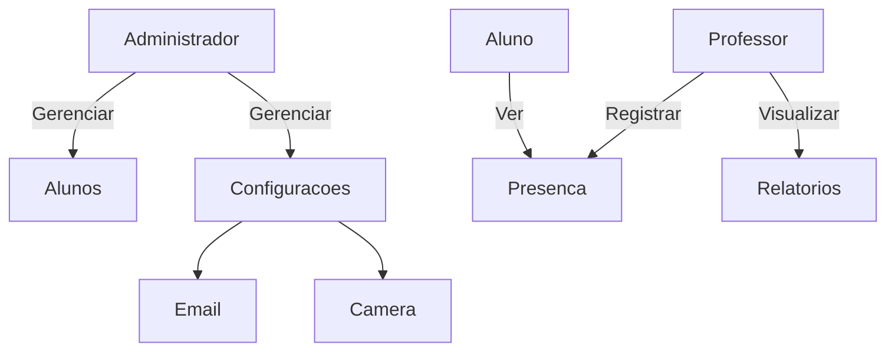
```mermaid
graph TD
    %% Atores
    Admin[Administrador]
    Professor[Professor]
    Aluno[Aluno]
    
    %% Casos de Uso
    Admin --> |Gerenciar| Alunos
    Admin --> |Gerenciar| Configuracoes
    Professor --> |Registrar| Presenca
    Professor --> |Visualizar| Relatorios
    Aluno --> |Ver| Presenca
    
    %% Relacionamentos
    Configuracoes --> Email
    Configuracoes --> Camera
```

#### 6. Diagrama de Atividades
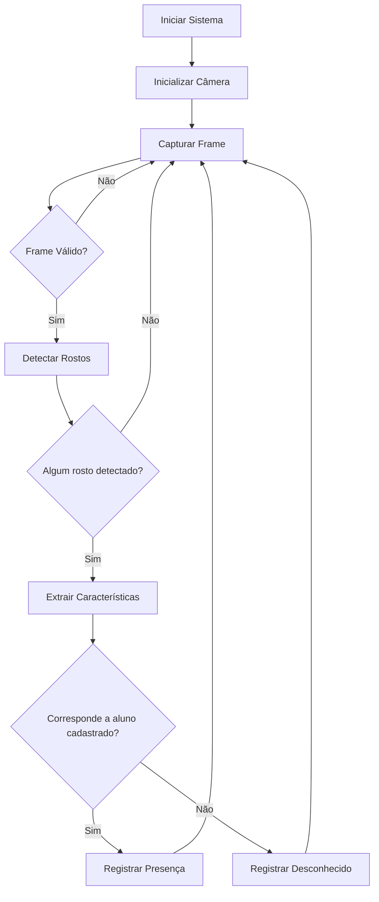
```mermaid
graph TD
    A[Iniciar Sistema] --> B[Inicializar Câmera]
    B --> C[Capturar Frame]
    C --> D{Frame Válido?}
    D -->|Sim| E[Detectar Rostos]
    D -->|Não| C
    E --> F{Algum rosto detectado?}
    F -->|Sim| G[Extrair Características]
    F -->|Não| C
    G --> H{Corresponde a aluno cadastrado?}
    H -->|Sim| I[Registrar Presença]
    H -->|Não| J[Registrar Desconhecido]
    I --> C
    J --> C
```

#### 7. Diagrama de Máquina de Estados
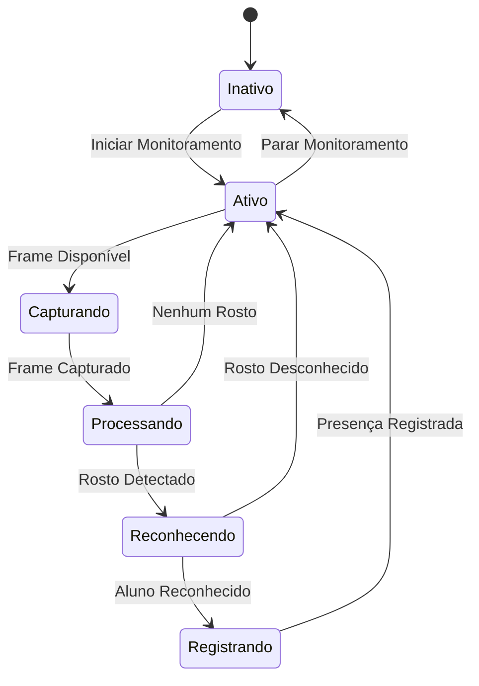
```mermaid
stateDiagram-v2
    [*] --> Inativo
    Inativo --> Ativo: Iniciar Monitoramento
    Ativo --> Inativo: Parar Monitoramento
    Ativo --> Capturando: Frame Disponível
    Capturando --> Processando: Frame Capturado
    Processando --> Reconhecendo: Rosto Detectado
    Reconhecendo --> Registrando: Aluno Reconhecido
    Registrando --> Ativo: Presença Registrada
    Reconhecendo --> Ativo: Rosto Desconhecido
    Processando --> Ativo: Nenhum Rosto
```

### 🔹 Diagramas de Interação

#### 8. Diagrama de Sequência - Registro de Presença
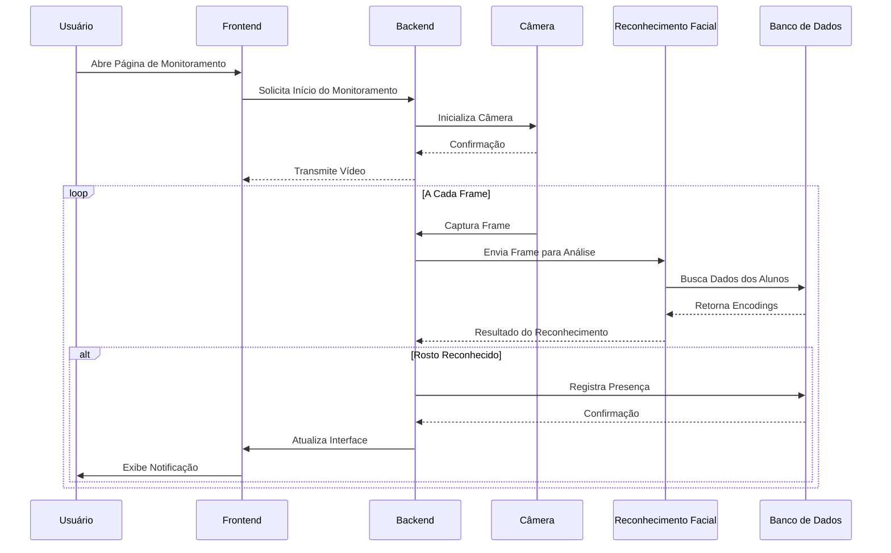
```mermaid
sequenceDiagram
    participant U as Usuário
    participant F as Frontend
    participant B as Backend
    participant C as Câmera
    participant R as Reconhecimento Facial
    participant D as Banco de Dados
    
    U->>F: Abre Página de Monitoramento
    F->>B: Solicita Início do Monitoramento
    B->>C: Inicializa Câmera
    C-->>B: Confirmação
    B-->>F: Transmite Vídeo
    
    loop A Cada Frame
        C->>B: Captura Frame
        B->>R: Envia Frame para Análise
        R->>D: Busca Dados dos Alunos
        D-->>R: Retorna Encodings
        R-->>B: Resultado do Reconhecimento
        
        alt Rosto Reconhecido
            B->>D: Registra Presença
            D-->>B: Confirmação
            B->>F: Atualiza Interface
            F->>U: Exibe Notificação
        end
    end
```

#### 9. Diagrama de Comunicação
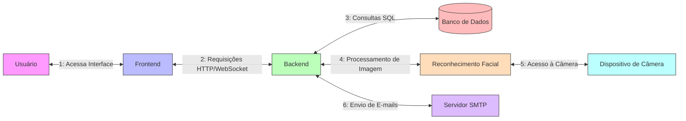
```mermaid
graph LR
    U[Usuário] <-->|1: Acessa Interface| F[Frontend]
    F <-->|2: Requisições HTTP/WebSocket| B[Backend]
    B <-->|3: Consultas SQL| D[(Banco de Dados)]
    B <-->|4: Processamento de Imagem| R[Reconhecimento Facial]
    R <-->|5: Acesso à Câmera| C[Dispositivo de Câmera]
    B <-->|6: Envio de E-mails| S[Servidor SMTP]
    
    style U fill:#f9f,stroke:#333
    style F fill:#bbf,stroke:#333
    style B fill:#bfb,stroke:#333
    style D fill:#fbb,stroke:#333
    style R fill:#fdb,stroke:#333
    style C fill:#bff,stroke:#333
    style S fill:#dbf,stroke:#333
```

#### 10. Diagrama de Visão Geral de Interação
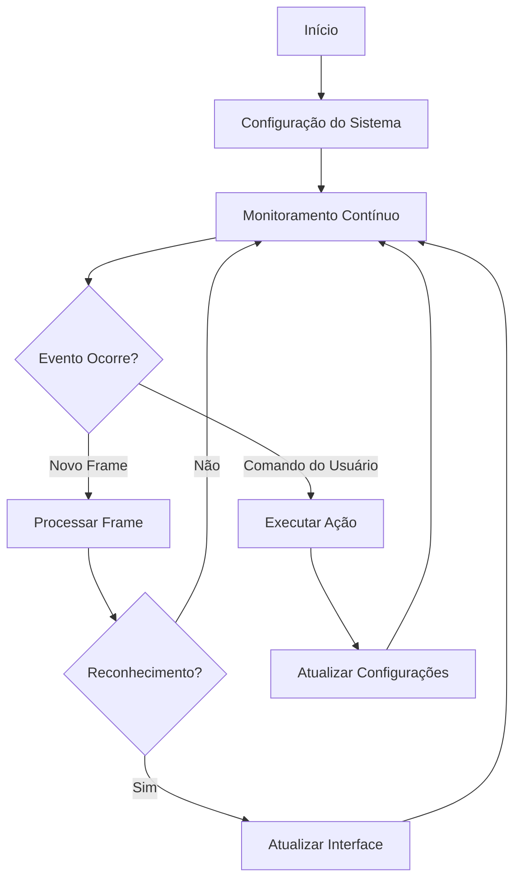
```mermaid
graph TD
    A[Início] --> B[Configuração do Sistema]
    B --> C[Monitoramento Contínuo]
    C --> D{Evento Ocorre?}
    D -->|Novo Frame| E[Processar Frame]
    D -->|Comando do Usuário| F[Executar Ação]
    E --> G{Reconhecimento?}
    G -->|Sim| H[Atualizar Interface]
    G -->|Não| C
    F --> I[Atualizar Configurações]
    I --> C
    H --> C
```

#### 11. Diagrama de Tempo
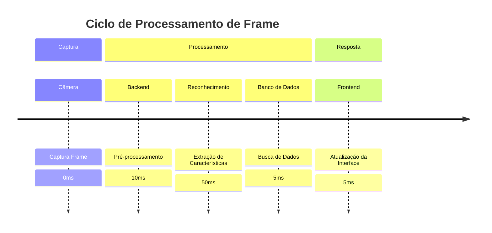
```mermaid
timeline
    title Ciclo de Processamento de Frame
    section Captura
        Câmera: Captura Frame : 0ms
    section Processamento
        Backend: Pré-processamento : 10ms
        Reconhecimento: Extração de Características : 50ms
        Banco de Dados: Busca de Dados : 5ms
    section Resposta
        Frontend: Atualização da Interface : 5ms
```

### 🔹 Diagrama de Implantação

#### 12. Diagrama de Implantação
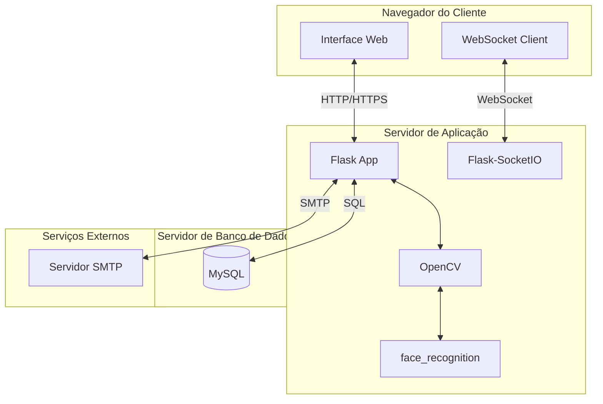
```mermaid
graph TD
    subgraph "Navegador do Cliente"
        A[Interface Web]
        B[WebSocket Client]
    end
    
    subgraph "Servidor de Aplicação"
        C[Flask App]
        D[Flask-SocketIO]
        E[OpenCV]
        F[face_recognition]
    end
    
    subgraph "Servidor de Banco de Dados"
        G[(MySQL)]
    end
    
    subgraph "Serviços Externos"
        H[Servidor SMTP]
    end
    
    A <-->|HTTP/HTTPS| C
    B <-->|WebSocket| D
    C <-->|SQL| G
    C <-->|SMTP| H
    C <--> E
    E <--> F
```

---

## ⚙️ Configuração do E-mail

O sistema inclui uma interface de configuração de e-mail integrada. Para configurar as notificações por e-mail:

1. Acesse a página de Configurações de E-mail na interface web
2. Insira os detalhes do seu servidor SMTP
3. Teste a configuração usando o botão de teste
4. Salve as configurações para uso futuro

### Configuração via Arquivo

Você também pode configurar o e-mail manualmente editando o arquivo `.env` na raiz do projeto:

```ini
SMTP_SERVER=seu.servidor.smtp.com
SMTP_PORT=587
SMTP_USERNAME=seu@email.com
SMTP_PASSWORD=sua_senha
SMTP_SENDER_EMAIL=seu@email.com
SMTP_USE_TLS=True
```

## 🚀 Como Executar

1. **Clone o repositório**
   ```bash
   git clone https://github.com/seu-usuario/repositorio.git
   cd repositorio
   ```

2. **Crie um ambiente virtual e ative-o**
   ```bash
   python -m venv venv
   .\venv\Scripts\activate  # No Windows
   # ou
   source venv/bin/activate  # No Linux/Mac
   ```

3. **Instale as dependências**
   ```bash
   pip install -r requirements.txt
   ```

4. **Configure o banco de dados**
   - Crie um banco de dados MySQL
   - Importe o esquema do banco de dados:
     ```bash
     mysql -u usuario -p nome_do_banco < bd.sql
     ```
   - Atualize as configurações do banco no arquivo `.env`

5. **Execute a aplicação**
   ```bash
   python app.py
   ```

6. **Acesse a aplicação**
   Abra seu navegador e acesse:
   ```
   http://localhost:5000
   ```

## ✅ Testes Automatizados e Qualidade

O projeto possui uma suíte completa de testes para backend (Python) e frontend (JavaScript), além de verificação de qualidade de código.

### Como executar

- Todos os testes (Python + JavaScript):
  ```bash
  python run_tests.py
  ```

- Somente testes Python:
  ```bash
  python run_tests.py --python-only
  ```

- Somente testes JavaScript (Jest):
  ```bash
  python run_tests.py --js-only
  ```

- Desabilitar cobertura de código (mais rápido):
  ```bash
  python run_tests.py --no-coverage
  ```

### Logs de execução com timestamp

- Toda execução gera um arquivo de log com timestamp em `logs/`, por exemplo:
  - `logs/test_run_YYYYMMDD-HHMMSS.log`
- O log espelha tudo o que é exibido no console, incluindo comandos executados, diretórios de trabalho, saída do pytest/Jest e o resumo final.

### Relatório HTML

- Para gerar um relatório HTML simples com apontadores de cobertura, use:
  ```bash
  python run_tests.py --report
  ```
- Cobertura Python: `htmlcov/index.html`
- Cobertura JavaScript: `coverage/index.html`

### Notas sobre testes JavaScript

- Se `node`/`npm` não estiverem disponíveis no ambiente, os testes JavaScript serão automaticamente pulados, sem falhar a execução. A mensagem correspondente será registrada no log.

### Endpoints atualizados

- Rotas de monitoramento foram padronizadas com o prefixo em inglês:
  - Iniciar: `POST /api/monitoring/start`
  - Parar: `POST /api/monitoring/stop`
- A rota de listagem de câmeras retorna `id` como string no payload (ex.: `{"id": "0", "name": "Câmera 1"}`). Ao consumir, converta para `int` se necessário.

### Validações atualizadas (cadastro)

As funções do módulo `cadastro.py` implementam validações mais robustas:

- `cadastrar_aluno(id_aluno, nome, frame, ...)`:
  - `id_aluno` deve ser numérico e maior que zero (senão: `ValueError`).
  - `nome` é obrigatório (senão: `ValueError`).
  - `frame` deve ser um `numpy.ndarray` não vazio com `dtype=uint8` (conversão é tentada; se inválido: `ValueError`).
  - Nenhum rosto detectado na imagem: `RuntimeError`.

- `editar_aluno(id_aluno, novo_nome, frame=None, ...)`:
  - `novo_nome` é obrigatório (`ValueError`).
  - Se `frame` for informado, as mesmas validações de imagem acima são aplicadas; se nenhum rosto for detectado, é lançado `RuntimeError`.

Essas regras previnem erros de OpenCV e melhoram a coerência dos retornos.

### Modo Teste

O sistema inclui um modo de teste completo que permite:

- **Cadastro**: Use arquivos de imagem ao invés de câmera física
- **Monitoramento**: Use arquivos de vídeo (MP4, AVI, MOV) ao invés de câmeras reais
- **Múltiplas Câmeras**: Teste com vários vídeos simultaneamente

Para usar o modo teste:
1. Coloque os vídeos de teste na pasta `test_videos/`
2. Ative o toggle "Modo Teste" na interface
3. Selecione o vídeo desejado para cada câmera

### Melhorias Recentes

- ✅ Correção de bugs na listagem de alunos
- ✅ Modo teste para cadastro com upload de arquivo
- ✅ Suporte para múltiplas câmeras simultâneas
- ✅ Interface melhorada com tema escuro otimizado
- ✅ Logs de debug extensivos para troubleshooting
- ✅ Tratamento robusto de erros em todas as camadas
- ✅ Validação de dados do responsável (telefone e e-mail)
- ✅ Atualização automática da lista de alunos ao abrir a aba

## 📂 Estrutura do Projeto

```
.
├── static/                 # Arquivos estáticos (CSS, JS, imagens)
│   ├── css/               # Folhas de estilo
│   └── js/                # Scripts JavaScript
├── templates/             # Templates HTML
├── .env                   # Variáveis de ambiente
├── .env.example           # Exemplo de variáveis de ambiente
├── .gitignore             # Arquivos ignorados pelo Git
├── app.py                 # Aplicação principal Flask
├── cadastro.py            # Módulo de cadastro de alunos
├── reconhecimento.py      # Módulo de reconhecimento facial
├── smtp_service.py        # Serviço de envio de e-mails
├── requirements.txt       # Dependências do Python
└── README.md              # Este arquivo
```

## 📄 Licença

Este projeto está licenciado sob a licença MIT - veja o arquivo [LICENSE](LICENSE) para mais detalhes.

## 🙏 Agradecimentos

- Aos desenvolvedores das bibliotecas de código aberto utilizadas neste projeto
- Aos professores e colegas pelo apoio e contribuições

---

# 🎓 Facial Recognition Attendance System

> **Note**: The following is the English version of the documentation.

## ✨ Core Features

- **Real-time Monitoring**  
  Monitor the camera feed and receive presence/absence logs every 30 seconds.  
- **Student Registration via Webcam**  
  Capture photos directly in the browser to register new facial profiles.  
- **Camera Selection**  
  Choose which video device to use for both monitoring and registration.  
- **Student Management**  
  Interface to list, edit (name/photo), and delete registered students.  
- **Modern Web Interface**  
  Responsive and interactive layout with real-time updates via Socket.IO.  
- **MySQL Persistence**  
  All information and facial encodings are stored in a relational database.

### 🛠️ Technical Stack
- **Backend**: Python (Flask + Flask-SocketIO)
- **Facial Recognition**: `face-recognition` and `opencv-python`
- **Database**: MySQL
- **Frontend**: HTML5, CSS3, JavaScript, Bootstrap 5, Socket.IO Client
- **Email Service**: SMTP with TLS

### 📋 Requirements
- Python 3.8+
- MySQL Server
- Webcam
- Internet connection (for email functionality)

---

## 📊 UML Diagrams

### 🔹 Structural Diagrams

#### 1. Class Diagram
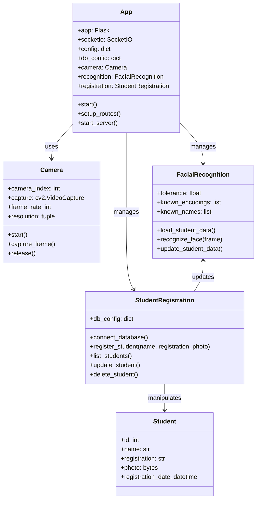
```mermaid
classDiagram
    %% Main Application Class
    class App {
        +app: Flask
        +socketio: SocketIO
        +config: dict
        +db_config: dict
        +camera: Camera
        +recognition: FacialRecognition
        +registration: StudentRegistration
        +start()
        +setup_routes()
        +start_server()
    }
    
    %% Camera Management
    class Camera {
        +camera_index: int
        +capture: cv2.VideoCapture
        +frame_rate: int
        +resolution: tuple
        +start()
        +capture_frame()
        +release()
    }
    
    %% Facial Recognition
    class FacialRecognition {
        +tolerance: float
        +known_encodings: list
        +known_names: list
        +load_student_data()
        +recognize_face(frame)
        +update_student_data()
    }
    
    %% Student Registration
    class StudentRegistration {
        +db_config: dict
        +connect_database()
        +register_student(name, registration, photo)
        +list_students()
        +update_student()
        +delete_student()
    }
    
    %% Student Class
    class Student {
        +id: int
        +name: str
        +registration: str
        +photo: bytes
        +registration_date: datetime
    }
    
    %% Relationships
    App --> Camera: uses
    App --> FacialRecognition: manages
    App --> StudentRegistration: manages
    StudentRegistration --> Student: manipulates
    FacialRecognition <-- StudentRegistration: updates
```

#### 2. Object Diagram
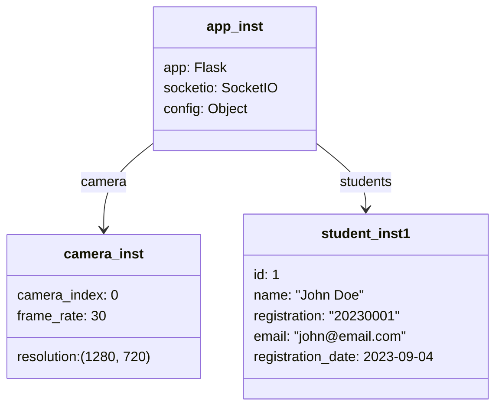
```mermaid
classDiagram
    class app_inst {
        app: Flask
        socketio: SocketIO
        config: Object
    }
    
    class camera_inst {
        camera_index: 0
        frame_rate: 30
        resolution: (1280, 720)
    }
    
    class student_inst1 {
        id: 1
        name: "John Doe"
        registration: "20230001"
        email: "john@email.com"
        registration_date: 2023-09-04
    }
    
    app_inst --> camera_inst: camera
    app_inst --> student_inst1: students
```

#### 3. Component Diagram
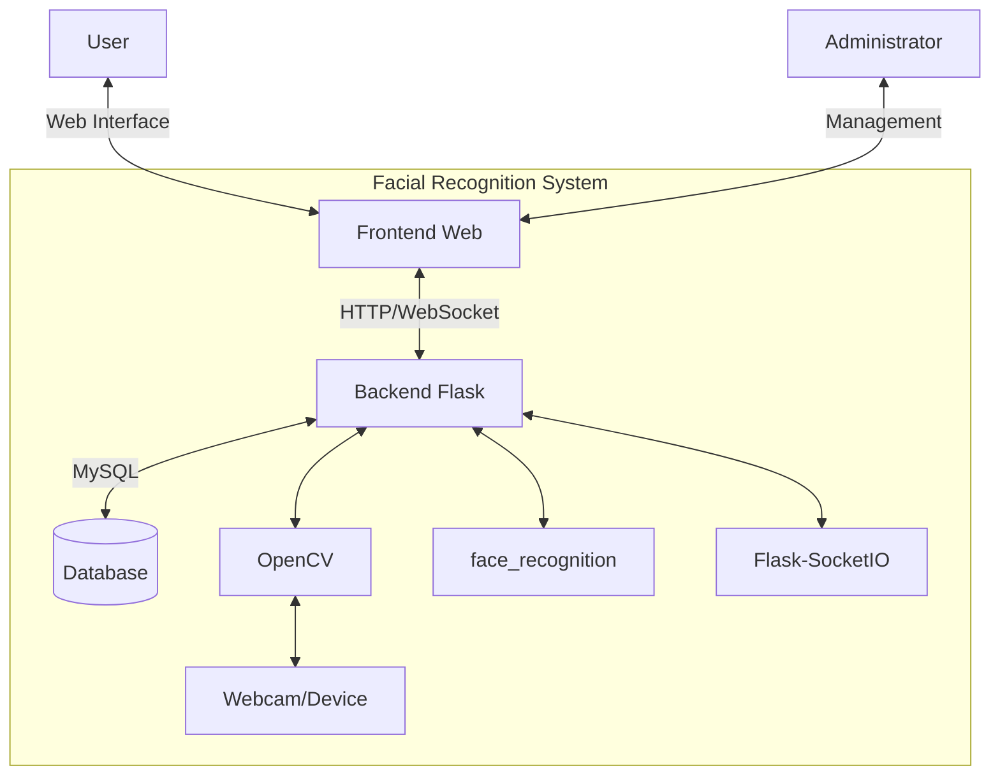
```mermaid
graph TD
    subgraph "Facial Recognition System"
        A[Frontend Web] <-->|HTTP/WebSocket| B[Backend Flask]
        B <-->|MySQL| C[(Database)]
        B <--> D[OpenCV]
        B <--> E[face_recognition]
        B <--> F[Flask-SocketIO]
        D <--> G[Webcam/Device]
    end
    
    H[User] <-->|Web Interface| A
    I[Administrator] <-->|Management| A
```

#### 4. Package Diagram
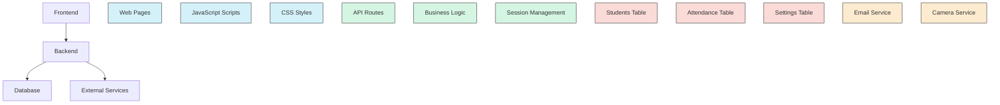
```mermaid
graph TD
    %% Main System
    A[Frontend] --> B[Backend]
    B --> C[Database]
    B --> D[External Services]
    
    %% Frontend
    A1[Web Pages]:::frontend
    A2[JavaScript Scripts]:::frontend
    A3[CSS Styles]:::frontend
    
    %% Backend
    B1[API Routes]:::backend
    B2[Business Logic]:::backend
    B3[Session Management]:::backend
    
    %% Database
    C1[Students Table]:::database
    C2[Attendance Table]:::database
    C3[Settings Table]:::database
    
    %% External Services
    D1[Email Service]:::services
    D2[Camera Service]:::services
    
    %% Styles
    classDef frontend fill:#d4f1f9,stroke:#333,stroke-width:1px
    classDef backend fill:#d5f5e3,stroke:#333,stroke-width:1px
    classDef database fill:#fadbd8,stroke:#333,stroke-width:1px
    classDef services fill:#fdebd0,stroke:#333,stroke-width:1px
```

### 🔹 Behavioral Diagrams

#### 5. Use Case Diagram
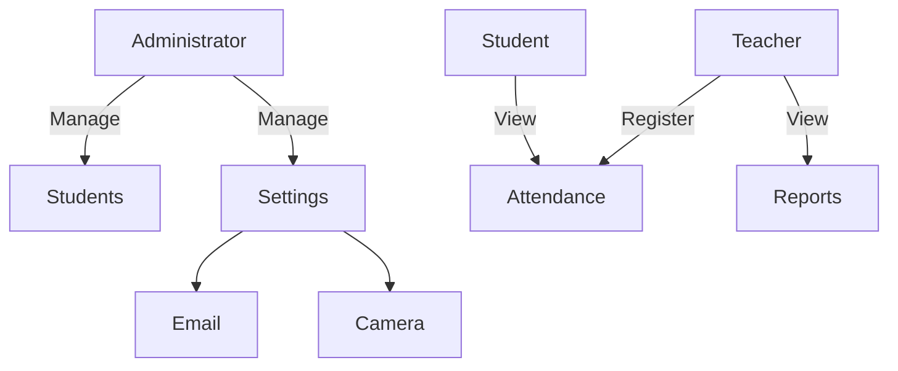
```mermaid
graph TD
    %% Actors
    Admin[Administrator]
    Teacher[Teacher]
    Student[Student]
    
    %% Use Cases
    Admin --> |Manage| Students
    Admin --> |Manage| Settings
    Teacher --> |Register| Attendance
    Teacher --> |View| Reports
    Student --> |View| Attendance
    
    %% Relationships
    Settings --> Email
    Settings --> Camera
```

#### 6. Activity Diagram
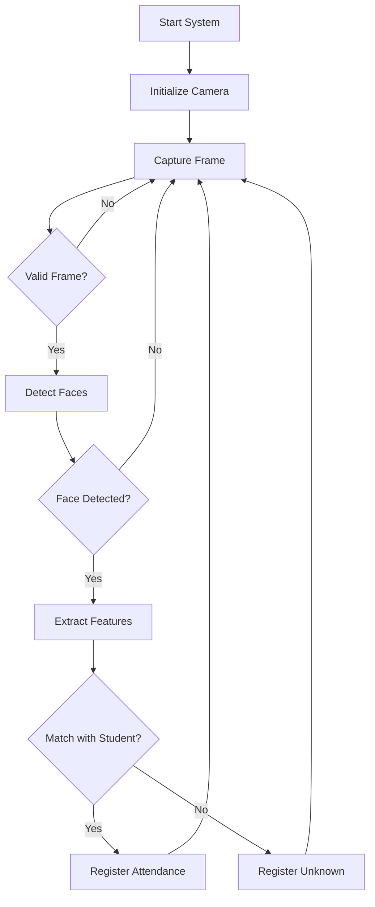
```mermaid
graph TD
    A[Start System] --> B[Initialize Camera]
    B --> C[Capture Frame]
    C --> D{Valid Frame?}
    D -->|Yes| E[Detect Faces]
    D -->|No| C
    E --> F{Face Detected?}
    F -->|Yes| G[Extract Features]
    F -->|No| C
    G --> H{Match with Student?}
    H -->|Yes| I[Register Attendance]
    H -->|No| J[Register Unknown]
    I --> C
    J --> C
```

#### 7. State Machine Diagram
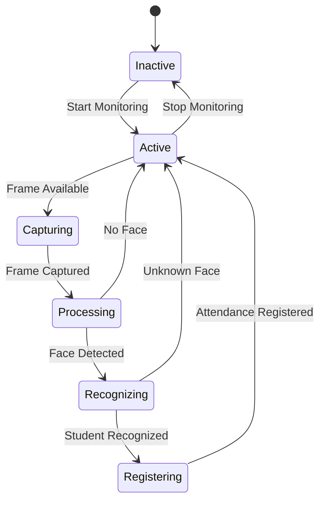
```mermaid
stateDiagram-v2
    [*] --> Inactive
    Inactive --> Active: Start Monitoring
    Active --> Inactive: Stop Monitoring
    Active --> Capturing: Frame Available
    Capturing --> Processing: Frame Captured
    Processing --> Recognizing: Face Detected
    Recognizing --> Registering: Student Recognized
    Registering --> Active: Attendance Registered
    Recognizing --> Active: Unknown Face
    Processing --> Active: No Face
```

### 🔹 Interaction Diagrams

#### 8. Sequence Diagram - Attendance Registration
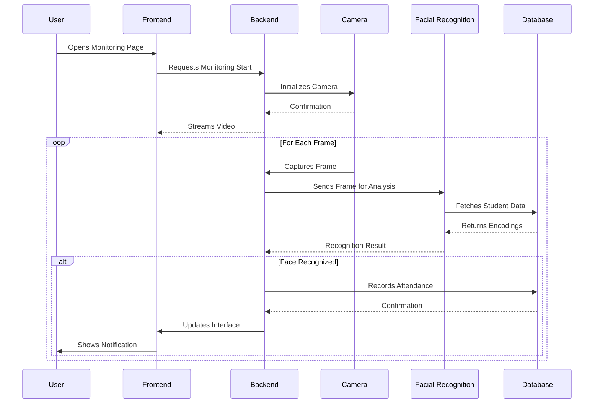
```mermaid
sequenceDiagram
    participant U as User
    participant F as Frontend
    participant B as Backend
    participant C as Camera
    participant R as Facial Recognition
    participant D as Database
    
    U->>F: Opens Monitoring Page
    F->>B: Requests Monitoring Start
    B->>C: Initializes Camera
    C-->>B: Confirmation
    B-->>F: Streams Video
    
    loop For Each Frame
        C->>B: Captures Frame
        B->>R: Sends Frame for Analysis
        R->>D: Fetches Student Data
        D-->>R: Returns Encodings
        R-->>B: Recognition Result
        
        alt Face Recognized
            B->>D: Records Attendance
            D-->>B: Confirmation
            B->>F: Updates Interface
            F->>U: Shows Notification
        end
    end
```

#### 9. Communication Diagram
```mermaid
graph LR
    U[User] <-->|1: Access Interface| F[Frontend]
    F <-->|2: HTTP/WebSocket Requests| B[Backend]
    B <-->|3: SQL Queries| D[(Database)]
    B <-->|4: Image Processing| R[Facial Recognition]
    R <-->|5: Camera Access| C[Camera Device]
    B <-->|6: Email Sending| S[SMTP Server]
    
    style U fill:#f9f,stroke:#333
    style F fill:#bbf,stroke:#333
    style B fill:#bfb,stroke:#333
    style D fill:#fbb,stroke:#333
    style R fill:#fdb,stroke:#333
    style C fill:#bff,stroke:#333
    style S fill:#dbf,stroke:#333
```

#### 10. Interaction Overview Diagram
```mermaid
graph TD
    A[Start] --> B[System Setup]
    B --> C[Continuous Monitoring]
    C --> D{Event Occurs?}
    D -->|New Frame| E[Process Frame]
    D -->|User Command| F[Execute Action]
    E --> G{Recognition?}
    G -->|Yes| H[Update Interface]
    G -->|No| C
    F --> I[Update Settings]
    I --> C
    H --> C
```

#### 11. Timing Diagram
```mermaid
timeline
    title Frame Processing Cycle
    section Capture
        Camera: Capture Frame : 0ms
    section Processing
        Backend: Pre-processing : 10ms
        Recognition: Feature Extraction : 50ms
        Database: Data Lookup : 5ms
    section Response
        Frontend: Interface Update : 5ms
```

### 🔹 Deployment Diagram

#### 12. Deployment Diagram
```mermaid
graph TD
    subgraph "Client Browser"
        A[Web Interface]
        B[WebSocket Client]
    end
    
    subgraph "Application Server"
        C[Flask App]
        D[Flask-SocketIO]
        E[OpenCV]
        F[face_recognition]
    end
    
    subgraph "Database Server"
        G[(MySQL)]
    end
    
    subgraph "External Services"
        H[SMTP Server]
    end
    
    A <-->|HTTP/HTTPS| C
    B <-->|WebSocket| D
    C <-->|SQL| G
    C <-->|SMTP| H
    C <--> E
    E <--> F
```

---

## ⚙️ Email Configuration

The system includes an integrated email configuration interface. To set up email notifications:

1. Access the Email Settings page in the web interface
2. Enter your SMTP server details
3. Test the configuration using the test button
4. Save the settings for future use

### File Configuration

You can also configure email manually by editing the `.env` file in the project root:

```ini
SMTP_SERVER=your.smtp.server.com
SMTP_PORT=587
SMTP_USERNAME=your@email.com
SMTP_PASSWORD=your_password
SMTP_SENDER_EMAIL=your@email.com
SMTP_USE_TLS=True
```

## 🚀 How to Run

1. **Clone the repository**
   ```bash
   git clone https://github.com/your-username/your-repo.git
   cd your-repo
   ```

2. **Create and activate a virtual environment**
   ```bash
   python -m venv venv
   .\venv\Scripts\activate  # On Windows
   # or
   source venv/bin/activate  # On Linux/Mac
   ```

3. **Install dependencies**
   ```bash
   pip install -r requirements.txt
   ```

4. **Set up the database**
   - Create a MySQL database
   - Import the database schema:
     ```bash
     mysql -u username -p database_name < bd.sql
     ```
   - Update the database settings in the `.env` file

5. **Run the application**
   ```bash
   python app.py
   ```

6. **Access the application**
   Open your browser and go to:
   ```
   http://localhost:5000
   ```

## ✅ Automated Tests and Quality

The project includes a comprehensive test suite for backend (Python) and frontend (JavaScript), plus code quality checks.

### How to run

- All tests (Python + JavaScript):
  ```bash
  python run_tests.py
  ```

- Python-only tests:
  ```bash
  python run_tests.py --python-only
  ```

- JavaScript-only tests (Jest):
  ```bash
  python run_tests.py --js-only
  ```

- Disable coverage (faster):
  ```bash
  python run_tests.py --no-coverage
  ```

### Timestamped execution logs

- Each run generates a timestamped log file under `logs/`, for example:
  - `logs/test_run_YYYYMMDD-HHMMSS.log`
- The log mirrors all console output, including executed commands, working directories, pytest/Jest output, and the final summary.

### HTML report

- To generate a simple HTML report with coverage pointers, use:
  ```bash
  python run_tests.py --report
  ```
- Python coverage: `htmlcov/index.html`
- JavaScript coverage: `coverage/index.html`

### Notes about JavaScript tests

- If `node`/`npm` are not available in the environment, JavaScript tests will be automatically skipped (without failing the run). The corresponding message is recorded in the log.

### Updated endpoints

- Monitoring routes have been standardized with an English prefix:
  - Start: `POST /api/monitoring/start`
  - Stop: `POST /api/monitoring/stop`
- The camera listing route returns `id` as a string in the payload (e.g., `{"id": "0", "name": "Câmera 1"}`). Convert to `int` if needed.

### Updated validations (cadastro)

The functions in `cadastro.py` implement more robust validations:

- `cadastrar_aluno(id_aluno, nome, frame, ...)`:
  - `id_aluno` must be numeric and greater than zero (otherwise: `ValueError`).
  - `nome` (name) is required (otherwise: `ValueError`).
  - `frame` must be a non-empty `numpy.ndarray` with `dtype=uint8` (conversion is attempted; if invalid: `ValueError`).
  - No face detected in the image: `RuntimeError`.

- `editar_aluno(id_aluno, novo_nome, frame=None, ...)`:
  - `novo_nome` is required (`ValueError`).
  - If `frame` is provided, the same image validations apply; if no face is detected, `RuntimeError` is raised.

These rules prevent OpenCV errors and improve return consistency.

## 📂 Project Structure

```
.
├── static/                 # Static files (CSS, JS, images)
│   ├── css/               # Stylesheets
│   └── js/                # JavaScript scripts
├── templates/             # HTML templates
├── .env                   # Environment variables
├── .env.example           # Example environment variables
├── .gitignore             # Git ignored files
├── app.py                 # Main Flask application
├── cadastro.py            # Student registration module
├── reconhecimento.py      # Facial recognition module
├── smtp_service.py        # Email sending service
├── requirements.txt       # Python dependencies
└── README.md              # This file
```

## 📄 License

This project is licensed under the MIT License - see the [LICENSE](LICENSE) file for details.

## 🙏 Acknowledgments

- To the developers of the open-source libraries used in this project
- To teachers and colleagues for their support and contributions

## ✨ Funcionalidades Principais

- **Monitoramento em Tempo Real**  
  Acompanhe o feed de vídeo da câmera e receba logs de presença e ausência a cada 30 segundos. Suporte para múltiplas câmeras simultâneas.  
- **Cadastro de Alunos**  
  - **Modo Normal**: Captura de foto diretamente no navegador via webcam para registrar novos perfis faciais.
  - **Modo Teste**: Upload de arquivo de imagem para cadastro sem necessidade de câmera física.
- **Seleção de Câmera**  
  Escolha qual dispositivo de vídeo usar tanto no monitoramento quanto no cadastro.  
- **Gerenciamento de Alunos**  
  Interface completa para listar, editar (nome/foto/responsável) e excluir alunos cadastrados. Atualização automática da lista ao abrir a aba.  
- **Modo Teste com Vídeos**  
  Teste o sistema usando arquivos de vídeo ao invés de câmeras reais. Suporte para múltiplos vídeos simultâneos.  
- **Interface Web Moderna**  
  Layout responsivo e interativo com atualizações em tempo real via Socket.IO. Tema escuro otimizado para melhor legibilidade.  
- **Persistência em MySQL**  
  Todas as informações e encodings faciais são armazenados em banco de dados relacional.  
- **Notificações por E-mail**  
  Sistema integrado de envio de e-mails para alertas e notificações aos responsáveis.  

---

## 📊 UML Diagrams / Diagramas UML

> **Note**: Each diagram is presented in both English and Portuguese versions.  
> *Nota*: Cada diagrama é apresentado nas versões em inglês e português.

### 🔹 Structural Diagrams / Diagramas Estruturais

### 🔹 Diagramas Estruturais

#### 1. Class Diagram / Diagrama de Classes
```mermaid
classDiagram
    %% Main Application Class
    class App {
        +app: Flask
        +socketio: SocketIO
        +config: dict
        +db_config: dict
        +camera: Camera
        +reconhecimento: ReconhecimentoFacial
        +cadastro: CadastroAluno
        +iniciar()
        +configurar_rotas()
        +iniciar_servidor()
    }
    
    %% Camera Management
    class Camera {
        +camera_index: int
        +capture: cv2.VideoCapture
        +frame_rate: int
        +resolucao: tuple
        +iniciar()
        +obter_frame()
        +liberar()
    }
    
    %% Facial Recognition
    class ReconhecimentoFacial {
        +encodings_known: list
        +nomes_known: list
        +alunos_presentes: set
        +tolerancia: float
        +modelo: str
        +carregar_dados()
        +reconhecer_face(frame)
        +processar_frame(frame)
    }
    
    %% Student Management
    class CadastroAluno {
        +conexao: MySQLConnection
        +cursor: Cursor
        +tabela_alunos: str
        +conectar()
        +cadastrar_aluno(nome, encoding, foto)
        +listar_alunos()
        +buscar_aluno_por_id(id)
        +atualizar_aluno(id, dados)
    }
    
    %% Data Model
    class Aluno {
        +id: int
        +matricula: str
        +nome: str
        +email: str
        +foto: bytes
        +encoding: bytes
        +data_cadastro: datetime
        +to_dict()
    }
    
    %% Relationships
    App --> Camera: uses
    App --> ReconhecimentoFacial: manages
    App --> CadastroAluno: manages
    CadastroAluno --> Aluno: manipulates
    ReconhecimentoFacial <-- CadastroAluno: updates
```

#### 2. Object Diagram / Diagrama de Objetos

**English Version**
```mermaid
classDiagram
    class app_inst {
        app: Flask
        socketio: SocketIO
        config: Object
    }
    
    class camera_inst {
        camera_index: 0
        frame_rate: 30
        resolution: (1280, 720)
    }
    
    class student_inst1 {
        id: 1
        name: "John Doe"
        registration: "20230001"
        email: "john@email.com"
        registration_date: 2023-09-04
    }
    
    app_inst --> camera_inst: camera
    app_inst --> student_inst1: students
```

**Versão em Português**
```mermaid
classDiagram
    class app_inst {
        app: Flask
        socketio: SocketIO
        config: Object
    }
    
    class camera_inst {
        indice_camera: 0
        taxa_quadros: 30
        resolucao: (1280, 720)
    }
    
    class aluno_inst1 {
        id: 1
        nome: "João Silva"
        matricula: "20230001"
        email: "joao@email.com"
        data_cadastro: 2023-09-04
    }
    
    app_inst --> camera_inst: camera
    app_inst --> aluno_inst1: alunos
```

#### 3. Component Diagram / Diagrama de Componentes

**English Version**
```mermaid
graph TD
    subgraph "Facial Recognition System"
        A[Frontend Web] <-->|HTTP/WebSocket| B[Backend Flask]
        B <-->|MySQL| C[(Database)]
        B <--> D[OpenCV]
        B <--> E[face_recognition]
        B <--> F[Flask-SocketIO]
        D <--> G[Webcam/Device]
    end
    
    H[User] <-->|Web Interface| A
    I[Administrator] <-->|Management| A
```

**Versão em Português**
```mermaid
graph TD
    subgraph "Sistema de Reconhecimento Facial"
        A[Frontend Web] <-->|HTTP/WebSocket| B[Backend Flask]
        B <-->|MySQL| C[(Banco de Dados)]
        B <--> D[OpenCV]
        B <--> E[face_recognition]
        B <--> F[Flask-SocketIO]
        D <--> G[Webcam/Dispositivo]
    end
    
    H[Usuário] <-->|Interface Web| A
    I[Administrador] <-->|Gerenciamento| A
```

#### 4. Package Diagram / Diagrama de Pacotes
```mermaid
classDiagram
    class app
    class recon
    class cad
    class templates
    class static
    
    app --> recon
    app --> cad
    app --> templates
    app --> static
    
    class recon {
        +ReconhecimentoFacial
        +processar_frame()
        +detectar_faces()
    }
    
    class cad {
        +CadastroAluno
        +conectar_bd()
        +gerenciar_alunos()
    }
```

### 🔹 Behavioral Diagrams / Diagramas Comportamentais

#### 1. Use Case Diagram / Diagrama de Casos de Uso
```mermaid
graph TD
    %% Atores
    Admin[Administrador]
    Professor[Professor]
    Aluno[Aluno]
    
    %% Casos de Uso
    Admin -->|Gerenciar| UC1[Usuários]
    Admin -->|Configurar| UC2[Sistema]
    Admin -->|Gerar| UC3[Relatórios]
    Professor -->|Iniciar| UC4[Monitoramento]
    Professor -->|Visualizar| UC5[Presenças]
    Professor -->|Exportar| UC6[Relatórios]
    Aluno -->|Registrar| UC7[Presença]
    Aluno -->|Visualizar| UC8[Frequência]
    
    %% Relacionamentos
    UC4 -->|Inclui| UC5
    UC5 -->|Estende| UC6
```

#### 2. Activity Diagram (Recognition Flow) / Diagrama de Atividades (Fluxo de Reconhecimento)
```mermaid
graph TD
    A[Iniciar Sistema] --> B[Inicializar Câmera]
    B --> C[Capturar Frame]
    C --> D{Frame Válido?}
    D -->|Sim| E[Detectar Rostos]
    D -->|Não| C
    E --> F{Encontrou Rosto?}
    F -->|Sim| G[Extrair Características]
    F -->|Não| C
    G --> H[Buscar no Banco de Dados]
    H --> I{Reconhecido?}
    I -->|Sim| J[Registrar Presença]
    I -->|Não| K[Registrar Desconhecido]
    J --> C
    K --> C
    
    style A fill:#9f9,stroke:#333
    style J fill:#f99,stroke:#333
    style K fill:#f99,stroke:#333
```

#### 3. State Machine Diagram (Student) / Diagrama de Máquina de Estados (Aluno)
```mermaid
stateDiagram-v2
    [*] --> NaoCadastrado
    NaoCadastrado --> Cadastrado: Cadastrar Aluno
    Cadastrado --> Presente: Registrar Presença
    Presente --> Ausente: Sair da Aula
    Ausente --> Presente: Retornar à Aula
    Cadastrado --> Inativo: Período sem Acesso
    Inativo --> Cadastrado: Reativar Cadastro
    Cadastrado --> [*]: Excluir Cadastro
```

### 🔹 Interaction Diagrams / Diagramas de Interação

#### 1. Sequence Diagram (Attendance Registration) / Diagrama de Sequência (Registro de Presença)
```mermaid
sequenceDiagram
    participant U as Usuário
    participant F as Frontend
    participant B as Backend
    participant R as Reconhecimento
    participant D as Banco de Dados
    
    U->>F: Acessa Monitoramento
    F->>B: GET /monitor/start
    B->>R: Iniciar Captura
    R-->>B: Confirmação
    B-->>F: WebSocket: Status Ativo
    
    loop A cada Frame
        R->>R: Processa Frame
        R->>D: Buscar Aluno(face_encoding)
        D-->>R: Dados do Aluno
        R->>D: Registrar Presença
        R-->>B: Frame Processado
        B-->>F: WebSocket: Atualização
        F->>U: Atualizar Interface
    end
    
    U->>F: Parar Monitoramento
    F->>B: POST /monitor/stop
    B->>R: Parar Captura
    R-->>B: Confirmação
    B-->>F: Confirmação
```

#### 2. Communication Diagram / Diagrama de Comunicação
```mermaid
graph LR
    A[Usuário] -->|1: Iniciar Monitoramento| B[Frontend]
    B -->|2: POST /monitor/start| C[Backend]
    C -->|3: Iniciar Captura| D[Reconhecimento]
    D -->|4: Frame Capturado| D
    D -->|5: Dados do Rosto| E[Banco de Dados]
    E -->|6: Dados do Aluno| D
    D -->|7: Atualização de Status| C
    C -->|8: WebSocket Update| B
    B -->|9: Atualizar UI| A
```

#### 3. Interaction Overview Diagram / Diagrama de Visão Geral de Interação
```mermaid
graph TD
    A[Início] --> B[Autenticação]
    B --> C{Sucesso?}
    C -->|Sim| D[Dashboard]
    C -->|Não| B
    
    subgraph Monitoramento
        D --> E[Iniciar Monitoramento]
        E --> F[Processar Frames]
        F --> G{Detectar Rosto?}
        G -->|Sim| H[Identificar Aluno]
        G -->|Não| F
        H --> I[Registrar Presença]
        I --> F
    end
    
    D --> J[Relatórios]
    D --> K[Gerenciar Alunos]
    
    style A fill:#9f9,stroke:#333
    style D fill:#bbf,stroke:#333
```

#### 4. Timing Diagram / Diagrama de Tempo
```mermaid
sequenceDiagram
    participant U as Usuário
    participant S as Sistema
    
    Note over U,S: Tempo de Resposta do Sistema
    
    U->>S: Iniciar Monitoramento
    activate S
    S-->>U: Confirmação (200ms)
    
    loop A cada Frame (33ms para 30fps)
        S->>S: Processar Frame
        alt Rosto Detectado
            S->>S: Identificar Aluno (50-150ms)
            S->>S: Atualizar Presença
        end
        S-->>U: Atualização de Frame
    end
    
    U->>S: Parar Monitoramento
    S-->>U: Confirmação (100ms)
    deactivate S
```

### 🔹 Deployment Diagram / Diagrama de Implantação
```mermaid
graph TD
    subgraph "Servidor"
        A[Aplicação Flask] --> B[Gunicorn/Nginx]
        A --> C[MySQL]
        A --> D[Redis]
    end
    
    subgraph "Cliente"
        E[Navegador Web]
    end
    
    F[Webcam] --> A
    B <-->|WebSocket| E
    
    style A fill:#f9f,stroke:#333
    style B fill:#bbf,stroke:#333
    style C fill:#bfb,stroke:#333
    style D fill:#fbb,stroke:#333
    style E fill:#9cf,stroke:#333
    style F fill:#9cf,stroke:#333
```

### Diagrama de Classes
```mermaid
classDiagram
    %% Main Application Class
    class App {
        +app: Flask
        +socketio: SocketIO
        +config: dict
        +db_config: dict
        +camera: Camera
        +reconhecimento: ReconhecimentoFacial
        +cadastro: CadastroAluno
        +iniciar()
        +configurar_rotas()
        +iniciar_servidor()
        +lidar_conexao()
    }
    
    %% Camera Management
    class Camera {
        +camera_index: int
        +capture: cv2.VideoCapture
        +frame_rate: int
        +resolucao: tuple
        +iniciar()
        +obter_frame()
        +liberar()
        +definir_resolucao(largura, altura)
        +obter_resolucao()
    }
    
    %% Facial Recognition
    class ReconhecimentoFacial {
        +encodings_known: list
        +nomes_known: list
        +alunos_presentes: set
        +tolerancia: float
        +modelo: str
        +carregar_dados()
        +reconhecer_face(frame)
        +processar_frame(frame)
        +desenhar_retangulos(frame, localizacoes, nomes)
        +atualizar_presencas()
        +obter_alunos_presentes()
    }
    
    %% Student Management
    class CadastroAluno {
        +conexao: MySQLConnection
        +cursor: Cursor
        +tabela_alunos: str
        +conectar()
        +fechar_conexao()
        +cadastrar_aluno(nome: str, encoding: bytes, foto: bytes) -> int
        +listar_alunos(pagina: int, por_pagina: int) -> list
        +buscar_aluno_por_id(id: int) -> dict
        +buscar_aluno_por_nome(nome: str) -> list
        +atualizar_aluno(id: int, dados: dict) -> bool
        +excluir_aluno(id: int) -> bool
        +obter_total_alunos() -> int
        +exportar_dados() -> bytes
    }
    
    %% Data Model
    class Aluno {
        +id: int
        +matricula: str
        +nome: str
        +email: str
        +curso: str
        +foto: bytes
        +encoding: bytes
        +data_cadastro: datetime
        +ultima_presenca: datetime
        +total_presencas: int
        +__init__(dados: dict)
        +to_dict() -> dict
        +validar_dados() -> bool
    }
    
    %% Relationships
    App --> Camera: uses
    App --> ReconhecimentoFacial: manages
    App --> CadastroAluno: manages
    CadastroAluno --> Aluno: manipulates
    ReconhecimentoFacial <-- CadastroAluno: updates
```

### Diagrama de Sequência - Fluxo de Reconhecimento
```mermaid
sequenceDiagram
    actor Usuário
    participant Navegador
    participant Frontend as Frontend (JS)
    participant Backend as Backend (Flask)
    participant Reconhecimento as Módulo de Reconhecimento
    participant DB as Banco de Dados
    
    %% Inicialização
    Usuário->>Navegador: Acessa /monitoramento
    Navegador->>Frontend: Carrega página
    Frontend->>Backend: GET /api/status
    Backend-->>Frontend: {status: ok, câmeras: [...]}
    
    %% Configuração Inicial
    Frontend->>Usuário: Exibe interface
    Usuário->>Frontend: Seleciona câmera e clica em Iniciar
    Frontend->>Backend: POST /api/monitor/start {camera_id: 0}
    
    %% Loop de Reconhecimento
    Backend->>Reconhecimento: iniciar_reconhecimento(camera_id)
    Reconhecimento-->>Backend: Confirmação de início
    Backend-->>Frontend: {status: 'iniciado', session_id: 'abc123'}
    
    par Para cada frame
        Reconhecimento->>Reconhecimento: capturar_frame()
        Reconhecimento->>Reconhecimento: detectar_faces()
        
        loop Para cada rosto detectado
            Reconhecimento->>Reconhecimento: extrair_caracteristicas()
            Reconhecimento->>DB: buscar_aluno_por_face(encoding)
            DB-->>Reconhecimento: {aluno_id, nome, confiança}
            
            alt Rosto reconhecido
                Reconhecimento->>DB: registrar_presenca(aluno_id)
                DB-->>Reconhecimento: {status: 'registrado'}
                Reconhecimento->>Reconhecimento: desenhar_identificacao(nome, confiança)
            else Rosto desconhecido
                Reconhecimento->>Reconhecimento: marcar_rosto_desconhecido()
            end
        end
        
        Reconhecimento->>Reconhecimento: codificar_frame_para_jpg()
        Reconhecimento-->>Backend: frame_processado
        Backend->>Frontend: socket.emit('video_frame', {frame: '...', timestamp: 12345})
        Frontend->>Navegador: Atualiza canvas com novo frame
    end
    
    %% Finalização
    Usuário->>Frontend: Clica em Parar
    Frontend->>Backend: POST /api/monitor/stop
    Backend->>Reconhecimento: parar_reconhecimento()
    Reconhecimento-->>Backend: Confirmação de parada
    Backend-->>Frontend: {status: 'parado'}
    Frontend->>Usuário: Exibe relatório de reconhecimento
```

### Diagrama de Casos de Uso
```mermaid
graph TD
    %% Atores
    Admin[Administrador]
    Professor[Professor]
    Aluno[Aluno]
    Sistema[Sistema]
    
    %% Casos de Uso - Administrativos
    subgraph Administrativo [Área Administrativa]
        A1[Gerenciar Usuários]
        A2[Configurar Sistema]
        A3[Gerar Relatórios]
        A4[Backup de Dados]
    end
    
    %% Casos de Uso - Professor
    subgraph ProfessorUC [Ações do Professor]
        P1[Iniciar Monitoramento]
        P2[Parar Monitoramento]
        P3[Visualizar Presenças]
        P4[Exportar Relatório]
        P5[Gerenciar Turmas]
    end
    
    %% Casos de Uso - Aluno
    subgraph AlunoUC [Ações do Aluno]
        AL1[Registrar Presença]
        AL2[Visualizar Frequência]
        AL3[Atualizar Dados Pessoais]
    end
    
    %% Relacionamentos
    Admin -->|Realiza| A1
    Admin -->|Configura| A2
    Admin -->|Gera| A3
    Admin -->|Executa| A4
    
    Professor -->|Pode| P1
    Professor -->|Pode| P2
    Professor -->|Pode| P3
    Professor -->|Pode| P4
    Professor -->|Pode| P5
    
    Aluno -->|Pode| AL1
    Aluno -->|Pode| AL2
    Aluno -->|Pode| AL3
    
    %% Fluxos Principais
    P1 -->|Inclui| Sistema
    P2 -->|Inclui| Sistema
    P3 -->|Consulta| Sistema
    P4 -->|Gera| Sistema
    AL1 -->|Registra| Sistema
    
    %% Extensões
    P1 -.->|Em caso de falha| P1_1[Exibir Erro]
    AL1 -.->|Se rosto não reconhecido| AL1_1[Registrar Falha]
    
    %% Estilo
    classDef actor fill:#f9f,stroke:#333,stroke-width:2px
    classDef useCase fill:#bbf,stroke:#333,stroke-width:1px
    classDef system fill:#bfb,stroke:#333,stroke-width:1px
    
    class Admin,Professor,Aluno actor
    class A1,A2,A3,A4,P1,P2,P3,P4,P5,AL1,AL2,AL3 useCase
    class Sistema system
```

## 🚀 Getting Started / Começando

### Prerequisites / Pré-requisitos
- Python 3.8+
- MySQL Server
- Webcam
- Git

### Installation / Instalação

1. **Clone the repository** / **Clone o repositório**
   ```bash
   git clone https://github.com/joaoLopesLenharo/reconhecimentoFacial.git
   cd reconhecimentoFacial
   ```

2. **Set up a virtual environment** / **Configure o ambiente virtual**
   ```bash
   # Linux/MacOS
   python3 -m venv venv
   source venv/bin/activate
   
   # Windows
   python -m venv venv
   .\venv\Scripts\activate
   ```

3. **Install dependencies** / **Instale as dependências**
   ```bash
   pip install -r requirements.txt
   ```

4. **Configure the database** / **Configure o banco de dados**
   - Create a MySQL database
   - Update the database configuration in `.env`
   - Run the database initialization script:
     ```bash
     mysql -u your_username -p your_database < bd.sql
     ```

5. **Configure email (optional)** / **Configure o e-mail (opcional)**
   - Copy `.env.example` to `.env`
   - Update the SMTP settings in `.env`
   - Or use the web interface to configure email after starting the application

### Running the Application / Executando a Aplicação

```bash
# Start the development server / Inicie o servidor de desenvolvimento
python app.py

# The application will be available at:
# A aplicação estará disponível em:
http://localhost:5000
```

## 📂 Project Structure / Estrutura do Projeto

```plaintext
.
├── app.py                   # Main Flask server and API routes / Servidor principal Flask e rotas da API
├── cadastro.py              # Student CRUD operations (MySQL) / Operações CRUD de alunos (MySQL)
├── reconhecimento.py        # Face recognition and attendance logic / Lógica de reconhecimento e controle de presença
├── smtp_service.py          # Email service configuration / Configuração do serviço de e-mail
├── requirements.txt         # Python dependencies / Dependências Python
├── bd.sql                   # Database initialization script / Script de criação do banco de dados
├── .env.example             # Example environment variables / Exemplo de variáveis de ambiente
├── .smtp_config.json        # SMTP configuration file / Arquivo de configuração SMTP
├── test_videos/             # Test videos directory / Diretório de vídeos de teste
├── templates/               # HTML templates / Modelos HTML
│   └── index.html           # Main page / Página principal
└── static/                  # Static files / Arquivos estáticos
    ├── css/
    │   ├── main.css         # Main styles (dark theme) / Estilos principais (tema escuro)
    │   ├── camera.css       # Camera view styles / Estilos para visualização de câmeras
    │   ├── camera-preview.css  # Camera preview styles / Estilos para preview de câmera
    │   └── forms.css        # Form styles / Estilos para formulários
    └── js/
        ├── app.js           # Front-end logic / Lógica front-end
        ├── camera-system.js # Camera management system / Sistema de gerenciamento de câmeras
        ├── camera-preview.js # Camera preview for registration / Preview de câmera para cadastro
        ├── form-validation.js # Form validation / Validação de formulários
        └── error-handler.js  # Error handling / Tratamento de erros
```

## 📧 Email Configuration / Configuração de E-mail

The system includes a built-in email configuration interface. To set up email notifications:

1. Go to the Email Settings page in the web interface
2. Enter your SMTP server details
3. Test the configuration using the test button

O sistema inclui uma interface de configuração de e-mail integrada. Para configurar as notificações por e-mail:

1. Acesse a página de Configurações de E-mail na interface web
2. Insira os detalhes do seu servidor SMTP
3. Teste a configuração usando o botão de teste

## 📄 License / Licença

This project is licensed under the MIT License - see the [LICENSE](LICENSE) file for details.

## 🙏 Acknowledgments / Agradecimentos

- [Face Recognition](https://github.com/ageitgey/face_recognition) - For the face recognition library
- [Flask](https://flask.palletsprojects.com/) - The web framework used
- [Bootstrap](https://getbootstrap.com/) - For the responsive design

## 🤝 Contributing / Contribuindo

Contributions are welcome! Please feel free to submit a Pull Request.

Contribuições são bem-vindas! Sinta-se à vontade para enviar um Pull Request.

---

## 🚀 Instalação e Execução

### Pré-requisitos

- Python 3.8 ou superior  
- MySQL instalado e em execução  
- Webcam conectada  

### Passo a passo

1. **Clone o repositório**  
   ```bash
   git clone https://github.com/SEU_USUARIO/SEU_REPOSITORIO.git
   cd SEU_REPOSITORIO
   ```

2. **Crie e ative um ambiente virtual**  
   ```bash
   # Linux/macOS
   python3 -m venv venv
   source venv/bin/activate

   # Windows
   python -m venv venv
   venv\Scripts\activate
   ```

3. **Instale as dependências**  
   ```bash
   pip install -r requirements.txt
   ```

4. **Configure o banco de dados**  
   - Abra `cadastro.py`  
   - Atualize o dicionário `DB_CONFIG` com suas credenciais MySQL:
     ```python
     DB_CONFIG = {
         'host': 'localhost',
         'user': 'seu_usuario_mysql',
         'password': 'sua_senha_mysql',
         'database': 'mydb'
     }
     ```  
   - As tabelas serão criadas automaticamente na primeira execução, ou você pode rodar manualmente:
     ```sql
     mysql -u seu_usuario_mysql -p mydb < bd.sql
     ```

5. **Inicie a aplicação**  
   ```bash
   python app.py
   ```
   Acesse em: `http://127.0.0.1:5000`

---

## 📖 Como Usar

1. **Aba de Monitoramento**  
   - Selecione a câmera ou ative o modo teste para usar vídeos
   - Clique em "Iniciar Monitoramento"  
   - Veja o feed e acompanhe logs a cada 30s  
   - Suporte para visualização de múltiplas câmeras simultaneamente

2. **Aba de Cadastro Rápido**  
   - **Modo Normal**:
     - Selecione a câmera  
     - Clique em "Abrir Câmera" e permita acesso  
     - Clique em "Tirar Foto" e posicione o rosto  
     - Preencha **ID**, **Nome** e dados do responsável (opcional)
     - Clique em "Registrar Aluno"
   - **Modo Teste**:
     - Ative o toggle "Modo Teste"
     - Selecione um arquivo de imagem (JPG, PNG, GIF, WEBP)
     - Preencha **ID**, **Nome** e dados do responsável (opcional)
     - Clique em "Registrar Aluno"

3. **Aba de Listagem de Alunos**  
   - Visualize todos os cadastros (carregamento automático ao abrir a aba)
   - Use o botão "Atualizar Lista" para recarregar os dados
   - Edite nome/foto/responsável ou exclua um perfil
   - Visualize informações de contato do responsável (telefone e e-mail)  

---

## 🤝 Contribuições

1. Faça um **fork** deste repositório  
2. Crie uma **branch** com sua feature:  
   ```bash
   git checkout -b feature/nova-funcionalidade
   ```  
3. **Commit** suas mudanças:  
   ```bash
   git commit -m "Adiciona nova funcionalidade"
   ```  
4. **Push** na branch:  
   ```bash
   git push origin feature/nova-funcionalidade
   ```  
5. Abra um **Pull Request** 😉

---

## 📄 Licença

Este projeto está licenciado sob a [MIT License](LICENSE).

---

# 🎓 Facial Recognition Attendance System

This project is a complete web application for student attendance tracking using real-time facial recognition. The system is built with:

- **Backend** in Python (Flask + Flask-SocketIO)  
- **Facial Recognition** with `face-recognition` and `opencv-python`  
- **Database** MySQL  
- **Frontend** HTML5, CSS3, JavaScript, Bootstrap 5, and Socket.IO Client  

---

## ✨ Key Features

- **Real-Time Monitoring**  
  Watch the camera feed and receive presence/absence logs every 30 seconds.  
- **Webcam-Based Registration**  
  Capture a photo directly in the browser to register new face profiles.  
- **Camera Selection**  
  Choose which video device to use for both monitoring and registration.  
- **Student Management**  
  Interface to list, edit (name/photo), and delete registered students.  
- **Modern Web Interface**  
  Responsive, interactive layout with real-time updates via Socket.IO.  
- **MySQL Persistence**  
  All student information and face encodings are stored in a relational database.  

---

## 📂 Project Structure

```plaintext
.
├── app.py                   # Main Flask server and API routes
├── cadastro.py              # Student CRUD (MySQL)
├── reconhecimento.py        # Recognition and attendance control logic
├── requirements.txt         # Python dependencies
├── bd.sql                   # Database creation script
├── templates/
│   └── index.html           # Main application page
└── static/
    ├── css/
    │   └── style.css        # Additional styles
    └── js/
        └── app.js           # Frontend logic (API, Socket.IO, camera)
```

---

## 🚀 Installation and Setup

### Prerequisites

- Python 3.8+  
- MySQL installed and running  
- Connected webcam  

### Steps to Run

1. **Clone the repository**  
   ```bash
   git clone https://github.com/YOUR_USER/YOUR_REPO.git
   cd YOUR_REPO
   ```

2. **Create and activate a virtual environment**  
   ```bash
   # Linux/macOS
   python3 -m venv venv
   source venv/bin/activate

   # Windows
   python -m venv venv
   venv\Scripts\activate
   ```

3. **Install dependencies**  
   ```bash
   pip install -r requirements.txt
   ```

4. **Configure the database**  
   - Open `cadastro.py`  
   - Update the `DB_CONFIG` dictionary with your MySQL credentials:
     ```python
     DB_CONFIG = {
         'host': 'localhost',
         'user': 'your_mysql_user',
         'password': 'your_mysql_password',
         'database': 'mydb'
     }
     ```  
   - Tables are auto-created on first run, or run manually:
     ```sql
     mysql -u your_mysql_user -p mydb < bd.sql
     ```

5. **Start the application**  
   ```bash
   python app.py
   ```
   Visit: `http://127.0.0.1:5000`

---

## 📖 Usage

1. **Monitoring Tab**  
   - Select camera  
   - Click “Start Monitoring”  
   - View feed and logs every 30s  

2. **Quick Registration Tab**  
   - Select camera  
   - Click “Open Camera” and allow access  
   - Click “Take Photo” and position face  
   - Enter **ID** and **Name**  
   - Click “Register Student”  

3. **Student List Tab**  
   - View all registrations  
   - Edit name/photo or delete a profile  

---

## 🤝 Contributing

1. Fork this repository  
2. Create a branch for your feature:  
   ```bash
   git checkout -b feature/new-feature
   ```  
3. Commit your changes:  
   ```bash
   git commit -m "Add new feature"
   ```  
4. Push to the branch:  
   ```bash
   git push origin feature/new-feature
   ```  
5. Open a Pull Request 😉

---

## 📄 License

This project is licensed under the MIT License (LICENSE).

---